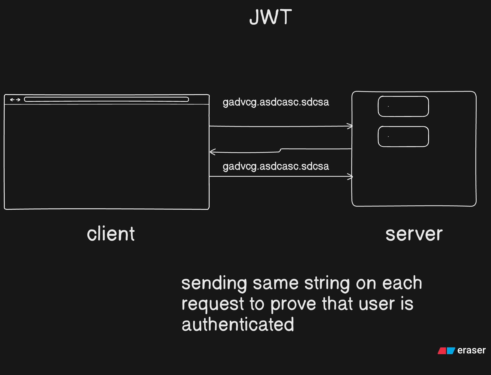

## 1. Initial Steps

1. Create a PRD
2. Add prettier
3. Add .gitignore
4. Add dotenv, .env

## 2. Dotenv

1. **dotenv.config()**

```
dotenv.config({
    path: "path to .env"
})
```

## 3. folder structure

- public
  - images
- src
  - controllers
  - db
  - middlewares
  - models
  - routes
  - utils
  - validators
  - app.js
  - index.js

## 4. Add routing library and database

1. Express
2. Mongoose

## 5. Add middlewares

1. `express.json({limit: "16kb})`
2. `express.urlencoded({ extended: true, limit: "16kb" })`

## 6. Add Cors

```js
app.use(
  cors({
    origin: process.env.CORS_ORIGIN?.split(",") || "http://localhost:5173",
    credentials: true,
    methods: ["GET", "POST", "PUT", "PATCH", "DELETE", "OPTIONS"],
    allowedHeaders: ["Content-Type", "Authorization"],
  })
);
```

## 7. Standardize the api response and error response

```js
class ApiResponse {
  constructor(statucCode, data, message = "Success") {
    this.statucCode = statucCode;
    this.data = data;
    this.message = message;
    this.success = statucCode < 400;
  }
}

export { ApiResponse };
```

```js
// ApiError.js
class ApiError extends Error {
  constructor(
    statusCode,
    message = "Something went wrong",
    errors = [],
    stack = ""
  ) {
    super(message);
    this.statusCode = statusCode;
    (this.data = null), (this.message = message);
    this.success = false;
    this.errors = errors;
    if (stack) {
      this.stack = stack;
    } else {
      Error.captureStackTrace(this, this.constructor);
    }
  }
}

export { ApiError };
```

## 8. Keeping data constants

```js
export default UserRoleEnum = {
  ADMIN: "admin",
  PROJECT_ADMIN: "project_admin",
  MEMBER: "member",
};

export const AvailableUserRoles = Object.values(UserRoleEnum);

export const TaskStatusEnum = {
  TODO: "todo",
  IN_PROGRESS: "in_progress",
  DONE: "done",
};

export const AvailableTaskStatuses = Object.values(TaskStatusEnum);
```

## 9. Add Mongodb Connection

```js
// db/index.js
import mongoose from "mongoose";

const connctDB = async () => {
  try {
    await mongoose.connect(process.env.MONGO_URI);
    console.log("✅ Mongodb connected");
  } catch (error) {
    console.error(" ❌ Mongodb Connection error", error);
    process.exit(1);
  }
};

export default connctDB;
```

```js
// index.js
connectDB()
  .then(() => {
    app.listen(PORT, () => {
      console.log(`Server running on port ${PORT}`);
    });
  })
  .catch((err) => {
    console.error("❌ Mongodb Connection error", err);
    process.exit(1);
  });
```

## 10. Add Healthcheck route

**Using extra asychHandler function**

`utils/asyncHandler.js`

```js
const asyncHandler = (requestHandler) => {
  return (req, res, next) => {
    Promise.resolve(requestHandler(req, res, next)).catch((err) => next(err));
  };
};

export { asyncHandler };
```

`controllers/healthcheck.controller.js`

```js
import { ApiResponse } from "../utils/api-response.js";
import { asyncHandler } from "../utils/async-handler.js";

// const healthCheck = async (req, res, next) => {
//   try {
//     const user = await getUserFromDB();
//     res
//       .status(200)
//       .json(new ApiResponse(200, { message: "Server is up and running" }));
//   } catch (error) {
//     next(error);
// 1. There is a chance that the `catch` part will never run, so we need to use `next()`
// 2. use less `try-catch` blocks
//   }
// };

const healthCheck = asyncHandler(async (req, res) => {
  res
    .status(200)
    .json(new ApiResponse(200, { message: "Server is up and running" }));
});

export { healthCheck };
```

## 11. Create a model for user

`models/user.model.js`

```js
import mongoose from "mongoose";

const userSchema = new mongoose.Schema(
  {
    avatar: {
      type: {
        url: String,
        localPath: String,
      },
      default: {
        url: `https://placehold.co/200x200`,
        localPath: "",
      },
    },
    userName: {
      type: String,
      required: true,
      unique: true,
      lowercase: true,
      trim: true,
      index: true,
    },
    email: {
      type: String,
      required: true,
      unique: true,
      lowercase: true,
      trim: true,
    },
    fullName: {
      type: String,
      trim: true,
    },
    password: {
      type: String,
      required: [true, "Password is required"],
    },
    isEmailVerified: {
      type: Boolean,
      default: false,
    },
    refreshToken: {
      type: String,
    },
    forgotPasswordToken: {
      type: String,
    },
    forgotPasswordExpiry: {
      type: Date,
    },
    emailverificationToken: {
      type: String,
    },
    emailverificationExpiry: {
      type: Date,
    },
  },
  { timestamps: true }
);

export const User = mongoose.model("User", userSchema);
```

## 12. Hash Passwords with Pre Hooks

```js
userSchema.pre("save", async function (next) {
  if (!this.isModified("password")) return next();
  this.password = await bcrypt.hash(this.password, 10);
  next();
});
```

## 13. Adding method in userschema to check encrypted password

```js
userSchema.methods.isPasswordCorrect = async function (password) {
  return await bcrypt.compare(this.password, password);
};
```

## 14. JWT token



[Introduction to JWT](https://www.jwt.io/introduction#what-is-json-web-token-structure)

## 15. Access Token and Refresh Token

### Token

Random Strings like - ajscbdhl

1. **without data**
   1. Server generates a token
   2. Generates Copy Token, sends one to client and keeps another
   3. If a client sends request with same token then client is verified
2. **with data**
   1. Server creates `Access Token` and `Refresh Token`.
   2. Sends both to client and saves only `Refresh Token` in database.
   3. Client Sends `Access Token` with each request and accesses server.
   4. `Access Token` has expiery time like 1 Day and `Refresh Token` has 10 day.
   5. After that period when user send `Expired access token`, server sends `401` status code.
   6. Client sends `Refresh Token`, server matches with database.
      1. If matched, server sends new `Access Token`

## 16. Code for Access Token, Refresh Token and Temporary Token

**Access Token**

`models/user.model.js`

```js
userSchema.methods.generateAccessToken = function () {
  return jwt.sign(
    {
      _id: this._id,
      email: this.email,
      userName: this.userName,
    },
    process.env.ACCESS_TOKEN_SECRET,
    { expiresIn: ACCESS_TOKEN_EXPIRY }
  );
};
```

**Refresh Token**

`models/user.model.js`

```js
userSchema.methods.generateRefreshToken = function () {
  return jwt.sign(
    {
      _id: this._id,
      email: this.email,
      userName: this.userName,
    },
    process.env.REFRESH_TOKEN_SECRET,
    { expiresIn: REFRESH_TOKEN_EXPIRY }
  );
};
```

**Temporary Token**

`models/user.model.js`

```js
userSchema.methods.generateTemporaryToken = function () {
  const unHashedToken = crypto.randomBytes(32).toString("hex");

  const hashedToken = crypto
    .createHash("sha256")
    .update(unHashedToken)
    .digest("hex");

  const tokenExpiry = Date.now() + 1000 * 60 * 20;
  return { unHashedToken, hashedToken, tokenExpiry };
};
```

---

## 17. Add email templates

1. [Mailgen](https://mailgen.js.org/)
2. [Nodemailer](https://nodemailer.com/about/)

`utils/email-templates.js`

```js
import mailgen from "mailgen";

const emailVerificationMailgenContent = (username, verificationUrl) => {
  return {
    body: {
      name: username,
      intro:
        "Welcome to project management app! We're very excited to have you on board.",
      action: {
        instructions: "To verify your email, please click here:",
        button: {
          color: "#22BC66",
          text: "verify your email",
          link: verificationUrl,
        },
      },
      outro:
        "Need help, or have questions? Just reply to this email, we'd love to help.",
    },
  };
};

const forgotPasswordMailgenContent = (username, passwordResetUrl) => {
  return {
    body: {
      name: username,
      intro: "You have requested to reset your password.",
      action: {
        instructions: "To reset your password, please click here:",
        button: {
          color: "#22BC66",
          text: "Reset your password",
          link: passwordResetUrl,
        },
      },
      outro:
        "Need help, or have questions? Just reply to this email, we'd love to help.",
    },
  };
};

export { emailVerificationMailgenContent, forgotPasswordMailgenContent };
```

## 18. How to send email

1. Production Email
   1. AWS SES
   2. Brevo
2. Development Email
   1. Mailtrap 

```js
import Mailgen from "mailgen";
import nodemailer from "nodemailer";

const sendEmail = async (options) => {
  const mailGenerator = new Mailgen({
    theme: "default",
    product: {
      name: "Task Manager",
      link: "https://taskmanagerlink.com",
    },
  });

  const emailTextual = mailGenerator.generatePlaintext(options.mailgenContent);
  const emailHTML = mailGenerator.generate(options.mailgenContent);

  const transporter = nodemailer.createTransport({
    host: process.env.MAILTRAP_SMTP_HOST,
    port: process.env.MAILTRAP_SMTP_PORT,
    auth: {
      user: process.env.MAILTRAP_SMTP_USER,
      pass: process.env.MAILTRAP_SMTP_PASS,
    },
  });

  const mail = {
    from: "mail.taskmanager@example.com",
    to: options.email,
    subject: options.subject,
    text: emailTextual,
    html: emailHTML,
  }

  try {
    await transporter.sendEmail(mail)
  } catch (error) {
    console.error("❌ Error sending email", error);
  }

};

const emailVerificationMailgenContent = (username, verificationUrl) => {
  return {
    body: {
      name: username,
      intro:
        "Welcome to project management app! We're very excited to have you on board.",
      action: {
        instructions: "To verify your email, please click here:",
        button: {
          color: "#22BC66",
          text: "verify your email",
          link: verificationUrl,
        },
      },
      outro:
        "Need help, or have questions? Just reply to this email, we'd love to help.",
    },
  };
};

const forgotPasswordMailgenContent = (username, passwordResetUrl) => {
  return {
    body: {
      name: username,
      intro: "You have requested to reset your password.",
      action: {
        instructions: "To reset your password, please click here:",
        button: {
          color: "#22BC66",
          text: "Reset your password",
          link: passwordResetUrl,
        },
      },
      outro:
        "Need help, or have questions? Just reply to this email, we'd love to help.",
    },
  };
};

export { emailVerificationMailgenContent, forgotPasswordMailgenContent, sendEmail };
```

---

## 19. Register User

